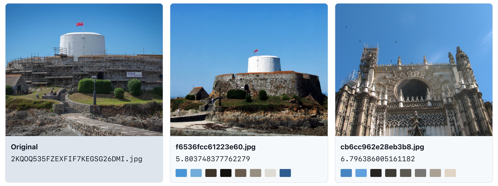
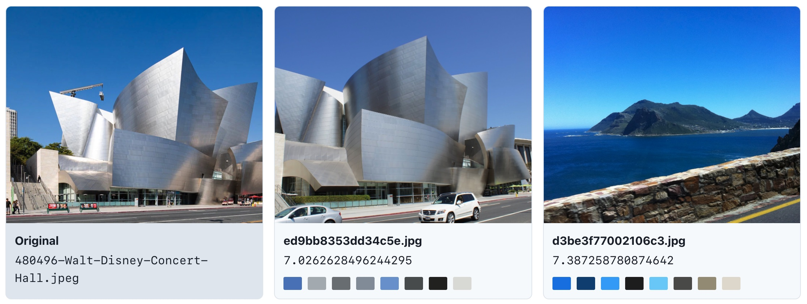

# 图片搜索引擎 Demo

本项目为《搜索引擎技术基础》课程实验（图片搜索引擎选题），使用[此数据集](https://www.kaggle.com/competitions/landmark-retrieval-2019/overview)实现一个简易的以图搜图搜索引擎。

技术选型：

- 后端 `backend`：flask，sqlite，redis
- 前端 `frontend`：react
- 下载器 `downloader`：go

各个部分详情请参考各子目录的 `README` 文件。报告详见 [report.pdf](report.pdf)。

## Build

在运行前，首先需要下载数据集，并建立索引。此部分参考各自的 `README`。

完成后，使用 docker-compose 在 Docker 中运行前后端和 Redis。注意修改 `docker-compose.yml` 中的目录挂载设置。

```
docker-compose up -d
```

## 搜索效果




